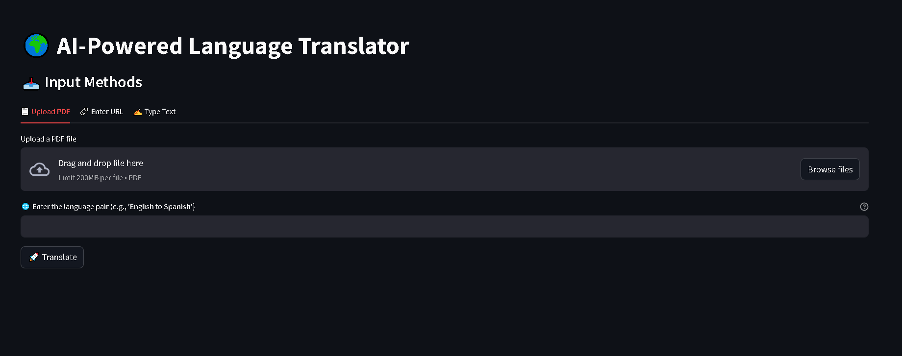

# AI-Powered Language Translator



## Overview
The AI-Powered Language Translator is a Streamlit-based web application that allows users to translate text extracted from various input sources, including PDFs, URLs, and direct text input. It utilizes Google Gemini API for accurate and context-aware translations.

## Features
- 📄 **Upload PDF**: Extracts and translates text from uploaded PDF files.
- 🔗 **Enter URL**: Fetches and translates text content from a provided URL.
- ✍️ **Type Text**: Allows users to manually enter text for translation.
- 🌐 **Multi-language Support**: Translates text between specified language pairs.
- 📥 **Download Translated Text**: Supports downloading translations in TXT and DOCX formats.
- 🚀 **User-Friendly Interface**: Intuitive Streamlit UI with real-time feedback.

## Tech Stack
- **Python**
- **Streamlit**
- **LangChain**
- **Google Gemini API**
- **dotenv** (for environment variables)

## Installation
1. Clone the repository:
   ```bash
   git clone https://github.com/PriyanshuDey23/TranslationAI.git
   cd language-translator
   ```
2. Create and activate a virtual environment:
   ```bash
   python -m venv venv
   source venv/bin/activate  # On macOS/Linux
   venv\Scripts\activate  # On Windows
   ```
3. Install dependencies:
   ```bash
   pip install -r requirements.txt
   ```
4. Set up environment variables:
   - Create a `.env` file in the project root.
   - Add your Google API Key:
     ```
     GOOGLE_API_KEY=your_google_api_key_here
     ```

## Usage
Run the Streamlit app:
```bash
streamlit run app.py
```

## Functionality Details
### Translation Process
1. Users can input text via PDF upload, URL entry, or direct typing.
2. The extracted text is displayed for preview.
3. Users specify the source and target language (e.g., "English to Spanish").
4. Upon clicking **Translate**, the text is processed via Google Gemini API.
5. The translated text is displayed and available for download.

### Code Overview
- `Translation_chain(input_text, languages)`: Handles text translation using LangChain and Google Gemini API.
- `extract_text_from_pdf(uploaded_file)`: Extracts text from uploaded PDFs.
- `extract_text_from_url(url)`: Fetches text from provided URLs.
- `convert_to_txt(response)`: Converts translated text to TXT format.
- `convert_to_docx(response)`: Converts translated text to DOCX format.

## Contributing
Feel free to contribute by submitting issues or pull requests.

## License
This project is licensed under the MIT License.


